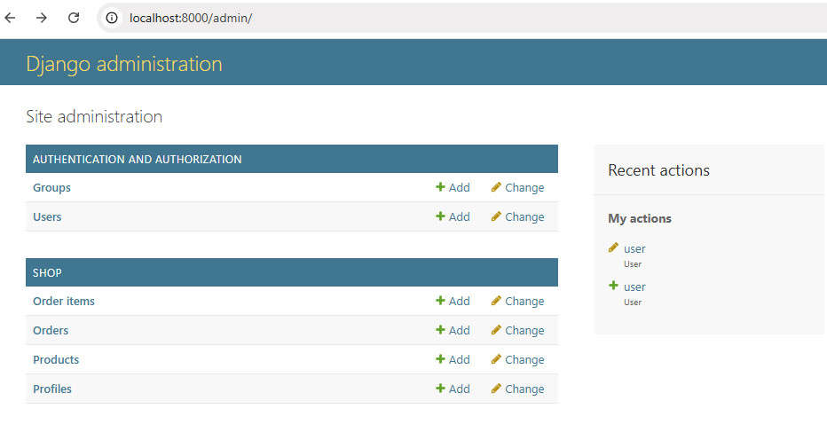

# Фреймворк Django (семинары)
# Урок 5. Работа с административной панелью
## Описание
На этом семинаре мы:
- разберёмся в настройке админ-панели;
- изучим добавление пользовательских моделей в панель;
- узнаем о разных способах персонализации админ-панели.

<br><hr>
## Домашнее задание
Уважаемые студенты! Обращаем ваше внимание, что сдавать домашнее задание необходимо через Git. <br>
Задание: <br>
Настройте под свои нужды вывод информации: 
- о клиентах, 
- о товарах,
- о заказах на страницах вывода информации об объекте,
- и о заказах на страницах вывода списка объектов.

<br><br><hr>
## Решение задания


Когда настроена админ-панель для вывода информации о клиентах, товарах и заказах, <br> 
можно управлять данными проекта через админ-панель Django. <br>
Требуется выполнить настройку админ-панели Django для вывода информации о клиентах, <br> 
товарах и заказах. <br> 
Выполнить настройку админ-панели можно с последовательностью следующих действий. <br>

##### - Создание суперпользователя

Если еще не создана запись admin, необходимо создать суперпользователя для доступа <br>
к админ-панели, добавить логин (admin) и пароль:

```bash
python manage.py createsuperuser
```

##### - Регистрация моделей в админ-панели

Изначально требуется выполнить регистрацию моделей в админ-панели. <br>
Для регистрации нужно обновить файл `admin.py` в приложении 'shop', <br> 
где будут зарегистрированы модели проекта для отображения в админ-панели:

```
from django.contrib import admin
from .models import Profile, Product, Order, OrderItem

@admin.register(Profile)
class ProfileAdmin(admin.ModelAdmin):
    list_display = ('user', 'first_name', 'last_name', 'email', 'phone_number', 'address_city', 'registration_date')
    search_fields = ('user__username', 'first_name', 'last_name', 'email', 'phone_number', 'address_city')
    list_filter = ('registration_date',)

@admin.register(Product)
class ProductAdmin(admin.ModelAdmin):
    list_display = ('name', 'description', 'price', 'quantity', 'added_date')
    search_fields = ('name', 'description')
    list_filter = ('added_date',)

@admin.register(Order)
class OrderAdmin(admin.ModelAdmin):
    list_display = ('client', 'total_amount', 'order_date')
    search_fields = ('client__username',)
    list_filter = ('order_date',)

@admin.register(OrderItem)
class OrderItemAdmin(admin.ModelAdmin):
    list_display = ('product', 'order', 'quantity')
    search_fields = ('product__name', 'order__id')

```

##### - Настройка URL-маршрутов

Дополнительно проверить, что в файле `urls.py` в основном каталоге проекта включены URL-маршруты для админ-панели:

```
from django.contrib import admin
from django.urls import path, include

urlpatterns = [
    path('admin/', admin.site.urls),
    
]
```

##### - Валидация ввода данных

Необходима валидация данных в админ-панели Django, чтобы администратор не мог вводить отрицательные значения стоимости или количества товара. <br>
Потребуется настройка валидации в файле `models.py`, чтобы добавить валидацию для полей `price` и `quantity` в модели `Product`. <br> 
Для добавления пользовательской валидации можно использовать метод `clean`:

```
from django.db import models
from django.core.exceptions import ValidationError
from django.contrib.auth.models import User

# Create your models here.

class Product(models.Model):
    name = models.CharField(max_length=100)
    description = models.TextField()
    price = models.DecimalField(max_digits=8, decimal_places=2)
    quantity = models.PositiveIntegerField(default=0)
    photo = models.ImageField(upload_to='product_photos/', null=True, blank=True)
    added_date = models.DateTimeField(auto_now_add=True)

    def __str__(self):
        return self.name

    def clean(self):
        if self.price < 0:
            raise ValidationError("Цена 'price' не может быть отрицательной.")
        if self.quantity < 0:
            raise ValidationError("Количество 'quantity' не может быть отрицательным.")

```

##### - Настройка валидации в админ-панели

Чтобы добавить валидацию для полей `price` и `quantity` в админ-панели, необходимо обновить файл `admin.py`. <br> 
Для этого в классе `ProductAdmin` также использовать метод `clean`:

```
from django.contrib import admin
from django.core.exceptions import ValidationError
from .models import Profile, Product, Order, OrderItem

@admin.register(Product)
class ProductAdmin(admin.ModelAdmin):
    list_display = ('name', 'description', 'price', 'quantity', 'added_date')
    search_fields = ('name', 'description')
    list_filter = ('added_date',)

    def clean(self):
        data = super().clean()
        if data.get('price') < 0:
            raise ValidationError("Цена 'price' не может быть отрицательной.")
        if data.get('quantity') < 0:
            raise ValidationError("Количество 'quantity' не может быть отрицательным.")
        return data
        
```


##### - Запуск сервера разработки

Создать и применить миграции для моделей проекта:

```bash
python manage.py makemigrations
python manage.py migrate
```

Следует запустить сервер разработки, чтобы проверить изменения. <br> 
Выполнить в корневой папке проекта команду:

```sh
python manage.py runserver
```

##### - Доступ к админ-панели

Открыть веб-браузер и перейти по адресу http://localhost:8000/admin/. <br>
Далее войти в систему, используя учетные данные суперпользователя.

<br><br>



<br><br>
**Для запуска проекта**:
- Скачать архив с проектом;
- Перейти в директорию проекта 'shop_project';
- Запустить команду ```python manage.py runserver```;
- Открыть в браузере страницу с адресом http://127.0.0.1:8000/;
- По окончанию работы с проектом, отключить комбинацией клавиш 'Ctrl+C'.

<br><br>
### Маршрутизация в браузере

<br><br>
- Страница admin-панели http://localhost:8000/admin/
  <br><br>
- Главная страница проекта http://127.0.0.1:8000/
- Список всех клиентов http://127.0.0.1:8000/clients/
- Список всех продуктов http://127.0.0.1:8000/products/
- Список всех заказов http://127.0.0.1:8000/orders/
  <br><br>
- Информация о конкретном клиенте http://127.0.0.1:8000/clients/1/, где ```http://127.0.0.1:8000/clients/{ID_клиента}/```
- Информация о конкретном товаре http://127.0.0.1:8000/products/1/, где ```http://127.0.0.1:8000/products/{ID_товара}/```
- Информация о конкретном заказе http://127.0.0.1:8000/orders/1/, где ```http://127.0.0.1:8000/orders/{ID_заказа}/```
  <br><br>
- Страница редактирования конкретного заказа http://127.0.0.1:8000/edit-order/1/, где ```http://127.0.0.1:8000/edit-order/{ID_заказа}/```
- Страница добавления нового клиента http://127.0.0.1:8000/add-client/
- Страница добавления нового товара http://localhost:8000/add-product/
- Страница добавления нового заказа http://localhost:8000/add-order/
- Страница редактирования профиля http://localhost:8000/update-profile/
  <br><br>
- Список всех заказов клиента http://127.0.0.1:8000/clients-orders/
- Список всех личных заказов http://127.0.0.1:8000/client-orders/


<br><br><hr>
## Дополнительная информация

<br><br>
### 1. Настройка админ-панели
Администраторская панель является мощным инструментом для управления контентом сайта. <br>
Требуются определенные настройки и расширения функциональности административной панели Django для успешной реализации проектов. <br>
По умолчанию административная панель доступна по адресу `/admin/`. 
Для её включения нужно зарегистрировать приложение `django.contrib.admin` в настройках проекта (`settings.py`), 
а также добавить ссылку на неё в маршруты (`urls.py`).

### 2. Регистрация приложения admin:

```
    INSTALLED_APPS = [
        ...
        'django.contrib.admin',
    ]
```

- Добавление пути в urls.py:

```
    from django.urls import path, include
    
    urlpatterns = [
        path('admin/', admin.site.urls),
    ]
```

Теперь можно зайти в админ-панель через браузер и увидеть стандартные объекты базы данных, такие как пользователи и группы.


<br><br>
### 3. Добавление пользовательских моделей в панель
Чтобы собственные модели были видны в админ-панели, потребуется их зарегистрировать. <br> 
**Это делается двумя способами**:

##### - Простое подключение модели:

Создать новый файл `admin.py` внутри приложения и зарегистрировать там свою модель. 
Таким образом, модель появится в списке объектов админ-панели:

```
    from django.contrib import admin
    from .models import Product    
    admin.site.register(Product)
```


##### - Способ более сложный с кастомизацией представления:

Например, есть модель продукта:

```
    class Product(models.Model):
        name = models.CharField(max_length=100)
        price = models.DecimalField(max_digits=8, decimal_places=2)
        description = models.TextField(blank=True)
```

Тогда в `admin.py` можно задать дополнительные опции для отображения и редактирования модели:

```
    @admin.register(Product)
    class ProductAdmin(admin.ModelAdmin):
        list_display = ('name', 'price')  # Отображение столбцов
        search_fields = ('name',)          # Поиск по имени товара
        ordering = ('-price',)             # Сортировка товаров по цене
```

Теперь продукт доступен в панели администратора с удобным интерфейсом фильтрации и сортировки.


<br><br>
### 4. Способы персонализации админ-панели
Административная панель позволяет настроить внешний вид и поведение практически всех элементов. <br>
Улучшения админ-панели можно добиться несколькими способами:

##### Изменение заголовков и логотипа

Можно изменить название проекта и логотип в панели:

```
    admin.site.site_header = "Магазин товаров"
    admin.site.index_title = "Панель администратора магазина"
```

Также можно заменить стандартную иконку (favicon) и даже изменить шаблон страницы целиком, добавив свои CSS-файлы.

##### Группировка моделей по категориям

Можно создать разные категории для разных видов моделей:

```
    class CustomAdminSite(admin.AdminSite):
        site_header = "Магазин товаров"
    
        def get_app_list(self, request):
            app_dict = self._build_app_dict(request)
            for app in app_dict.values():
                if app["app_label"] == "shop":
                    app["label"] = "Продукты"
            
            return sorted(app_dict.values(), key=lambda x: x["label"])
    
    custom_admin_site = CustomAdminSite(name="customadmin")
```

##### Кастомизация списков и фильтров

У каждой модели можно задать отдельные фильтры, списки колонок и другие возможности, что позволит сделать интерфейс более информативным:

```
    class OrderAdmin(admin.ModelAdmin):
        list_filter = ("status", "created_at")   # Фильтры
        readonly_fields = ["order_id"]           # Только чтение
        fieldsets = (
            (None, {"fields": ("customer_name",)}),
            ("Дополнительные сведения", {"fields": ("address", "phone_number")}),
        )                                       # Группа полей
```

<br><br>
## Инструкция

### Установка и удаление django-debug-toolbar в Django (Windows)

**Требуется**: <br>
- Установка django-debug-toolbar в проект Django.
- Настройка для корректной работы.
- Удаление из проекта, если необходимо передавать проект деплой.


##### 1. Установка django-debug-toolbar

- Установка через pip
Открыть командную строку (cmd) или терминал (PowerShell, VS Code, PyCharm), активировать виртуальное окружение, если используется, и выполнить:

```bash
  pip install django-debug-toolbar
```

- Добавление в INSTALLED_APPS
Открыть settings.py и добавить 'debug_toolbar' в список установленных приложений:

```
    INSTALLED_APPS = [
    # ... другие приложения ...
    'debug_toolbar',
    'django.contrib.staticfiles',  # убедитесь, что это есть (необходимо для debug-toolbar)
    ]
```

- Добавление middleware
В том же settings.py добавить DebugToolbarMiddleware в MIDDLEWARE. <br>
*Важно!* DebugToolbarMiddleware должно быть как можно раньше в списке,  <br>
но после django.middleware.security.SecurityMiddleware и подобных.

```
    MIDDLEWARE = [
    # ... другие middleware ...
    'debug_toolbar.middleware.DebugToolbarMiddleware',
    # 'django.middleware.security.SecurityMiddleware' и другие должны быть выше
    ]
```

- Настройка INTERNAL_IPS для отображения панели
Чтобы панель отображалась только в локальной разработке, добавить в settings.py:

```
    INTERNAL_IPS = [
    '127.0.0.1',
    ]
```

Если используется Docker или другой хост, указать его:  
```
    INTERNAL_IPS = ['*']  # Небезопасно для продакшена! Только для разработки.
```

- Настройка URLs в urls.py
В главном urls.py проекта добавить:

```
    from django.conf import settings
    from django.urls import include, path
    
    urlpatterns = [
    # ... ваши URL-адреса ...
    ]
    
    if settings.DEBUG:
    import debug_toolbar
    urlpatterns += [
    path('__debug__/', include(debug_toolbar.urls)),
    ]
```

##### 2. Проверка работы 
- Убедиться, что в settings.py установлено:  
```
   DEBUG = True
```
- Запустить сервер:  
```bash
   python manage.py runserver
```
- Открыть любую страницу в браузере - справа должна появиться панель Debug Toolbar.


##### 3. Возможные проблемы и их решение

**Панель не отображается**
- Проверить DEBUG = True.
- Убедиться, что 'django.contrib.staticfiles' в INSTALLED_APPS.
- Проверить INTERNAL_IPS (если сервер на localhost, должно быть 127.0.0.1).
- Попробовать очистить кеш браузера или открыть в приватном режиме.

**Ошибка 404 для /__debug__/**
- Убедиться, что urls.py настроен правильно (см. п. 1.5).
- Перезапустить сервер.

**Панель есть, но неактивна**
- Проверить, нет ли ошибок в консоли браузера (F12 → Console).
- Убедиться, что STATIC_URL в settings.py настроен:  
```
  STATIC_URL = '/static/'
```

##### 4. Удаление django-debug-toolbar

Если панель больше не нужна:

- Удаление пакета
```bash
  pip uninstall django-debug-toolbar
```

- Удаление из INSTALLED_APPS
В settings.py удалить строку:  
```
    'debug_toolbar',
```

- Удаление из MIDDLEWARE
В settings.py удалить:  
```
    'debug_toolbar.middleware.DebugToolbarMiddleware',
```

- Удаление URL
В urls.py удалить блок:  
```
    if settings.DEBUG:
    import debug_toolbar
    urlpatterns += [
    path('__debug__/', include(debug_toolbar.urls)),
    ]
```

- Очистка кеша (опционально)
Если после удаления остались артефакты:
1. Удалить папку __pycache__ в проекте.
2. Очистить кеш браузера.


##### 5. Общие действия
- *Установка*: pip install, добавление в INSTALLED_APPS, MIDDLEWARE, urls.py, проверка DEBUG = True.
- *Проблемы*: Чаще всего из-за DEBUG = False, неправильных INTERNAL_IPS или ошибок в urls.py.
- *Удаление*: pip uninstall, удаление из настроек Django.


<br><br><br><br>
<hr><hr><hr><hr>